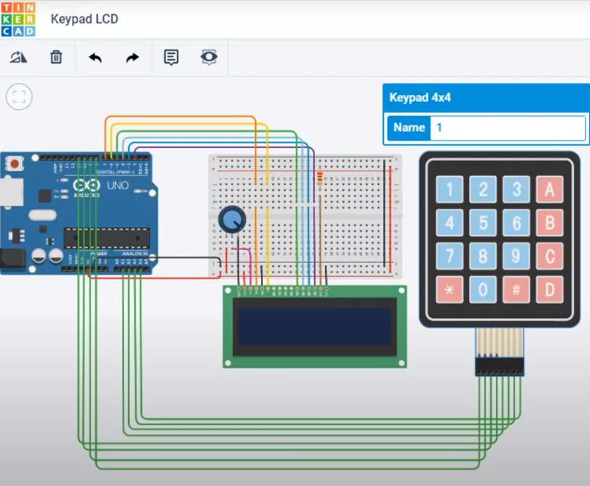

# PIN Code based door lock 
This project is a pin code based door lock system built with an Arduino Uno board. The device allows users to enter a 4-digit code (or more) the password can be a combination of numbers and letters to enhance the security and to avoid brute-force attacks.

## Hardware Required
* Arduino board - Uno is a good choice 
* 4*4 Keypad module
* Breadboard
* M-M Jumper wires
* 9V battery (or any 7v -12v power supply)

## Hardware Connection Map

## How to Use
1. Upload the code.ino file to your Arduino Uno board using the Arduino IDE.
2. Connect the keypad module and the LCD to the Arduino board according to the hardware connection map.
3- Power the Arduino board with a 9V battery.
4- Enter the pre-set 4-digit code on the keypad to unlock the door.

## License
This project is licensed under the MIT License
